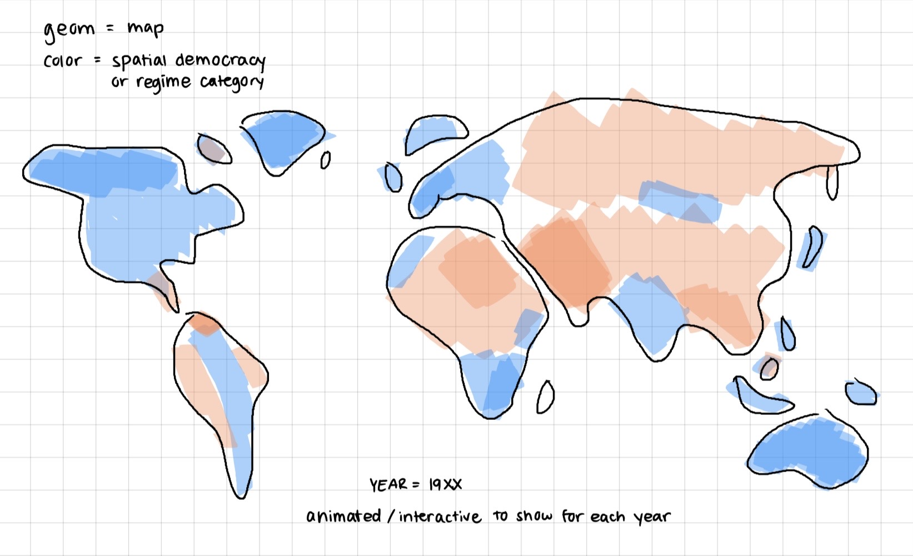
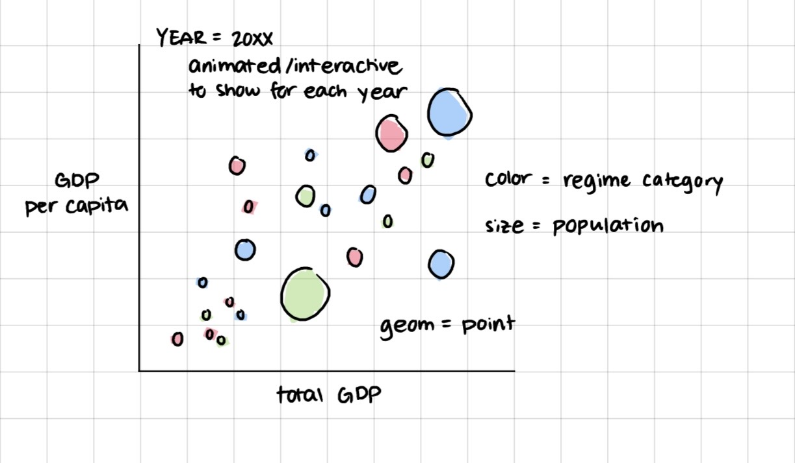

```{r steup}
#| echo: false

library(tidyverse)
```

```{r load in data}

democracy_data <- readr::read_csv('https://raw.githubusercontent.com/rfordatascience/tidytuesday/main/data/2024/2024-11-05/democracy_data.csv')

```

## Data Context

This dataset is based on the PACL dataset from J. A. Cheibub, J. Gandhi, and J. R. Vreeland. "Democracy and Dictatorship Revisited". In: Public Choice 143.1-2 (2009), pp. 67-101. DOI: 10.1007/s11127-009-9491-2.

Each row represents a country and year. The columns describe the political system and leader of the country during the year. Regarding the system, the columns include it's specific regime category as defined by Cheibub, Ghandi and Vreeland (2010), additional indicator variables of certain more general systems, and details of the election process as applicable. Regarding the leader, the columns include details such as their name, birth year, and gender, as well as details about their term as applicable.

## Data Cleaning

The cleaning process performed on this data included:

-   Selecting and renaming relevant variables from the PACL dataset

-   Handling NA's within the original election month variable, separating its month and year into two separate variables, and cleaning white spaces

-   Recoding the electoral category from numbers to descriptive categories

-   Converting variables of indexes, years, member counts, and the count of parliament chambers to numeric values

-   Converting indicator variables to boolean/logical variables

## Research Questions

### With these data

1.  How have the frequencies of different political systems changed over time?

2.  How stable are the governments of newly independent countries (formally colonized)?

3.  How do the democracies of countries that had previously experienced dictatorships differ from countries that had not?

### With Supplemental Data

1.  How many countries that had switched from dictatorships to democracies elect a relative of a previous dictator?

2.  How do the economies of countries of different government systems compare?

## Visualization Sketches




